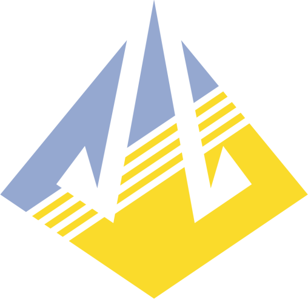

# Marvel Rivals Info (마블 라이벌즈 영웅 스킬 도감)

<p align="center">
  
</p>

> 마블 라이벌즈(Marvel Rivals) 전체 영웅(53명)의 정밀 스킬 수치, 베이스 스탯(HP, SPD), 최신 팀업(Team-Up) 어빌리티 정보를 한국어(KO), 일본어(JA), 영어(EN)로 제공하는 웹 도감입니다.

---

## ✨ 주요 기능 (Features)

- 🌐 **완벽한 3개 국어 지원 (Multi-Language Support)**
  - 한국어(KR), 日本語(JP), English(EN) 실시간 원클릭 전환
  - 영웅 이름, 역할군, 스킬 명칭 및 상세 설명, 툴팁 수치 다국어 지원
- 📊 **정밀한 스킬 수치 & 스탯 표기 (Accurate Stats & Numbers)**
  - 영웅 기본 체력(HP) 및 이동 속도(SPD, m/s 단위 정규화)
  - 스킬별 데미지, 치유량, 쿨다운, 소모 자원 등 상세 수치 완벽 표시
- 🤝 **최신 팀업 로드아웃 정보 (Updated Team-Up Loadouts)**
  - 각 영웅의 팀업 스킬, 연계 파트너 영웅(초상화 및 이름), 강화 대상 스킬 정보 제공
- ⌨️ **공식 HUD / 인게임 키 순서 정렬 (In-Game Key Priority Alignment)**
  - 일반 공격(Left/Right Click) ➔ 궁극기(Q) ➔ Shift ➔ E ➔ F ➔ 패시브 순으로 직관적 정렬
- 🛡️ **역할군 필터링 & 검색 (Role Filter & Search)**
  - 공식 역할군 아이콘 적용 (뱅가드, 듀얼리스트, 전략가)
  - 영웅명 실시간 검색 및 역할군별 즉각 필터링

---

## 📁 프로젝트 구조 (Project Structure)

```text
marvelrivalsinfo/
├── assets/
│   ├── ignite_icon.png            # 마블 라이벌즈 공식 Ignite 아이콘 (파비콘 및 헤더)
│   └── icons/                     # 공식 역할군 아이콘 (뱅가드, 듀얼리스트, 전략가)
├── data/
│   ├── heroes.json                # 53명 전체 영웅의 스킬, 스탯, 팀업 통합 데이터
│   └── i18n.json                  # 다국어 UI 라벨 사전 (KO, JA, EN)
├── scripts/
│   ├── sync_heroes.py             # 공식 웹 프론트엔드 실시간 파싱 및 데이터 동기화 스크립트
│   ├── validate_heroes.py         # 데이터 정합성 검증 스크립트
│   └── test_integration.js        # 통합 자동화 테스트
├── app.js                         # 웹 애플리케이션 프론트엔드 로직
├── index.html                     # 메인 웹 페이지
├── styles.css                     # 네오-브루탈리즘 & 게이밍 다크 테마 스타일시트
└── README.md
```

---

## 🚀 실행 방법 (Getting Started)

별도의 백엔드 설치 없이 정적 웹 서버 환경에서 바로 실행할 수 있습니다.

### 1. 로컬 웹 서버 실행 (권장)
```bash
# Python 내장 서버 실행
python3 -m http.server 3000
```
브라우저에서 `http://localhost:3000` 접속

또는 Node.js `npx serve`:
```bash
npx serve .
```

### 2. 데이터 최신화 (동기화)
공식 웹사이트의 신규 영웅 또는 패치 사항을 다시 가져오려면 아래 스크립트를 실행합니다:
```bash
python3 scripts/sync_heroes.py
```

---

## 📄 라이선스 (License)

본 프로젝트는 팬메이드 비공식 프로젝트이며, 마블 라이벌즈와 관련된 모든 캐릭터, 이미지 및 상표의 권리는 Marvel 및 NetEase Games에 있습니다.
